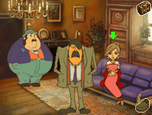
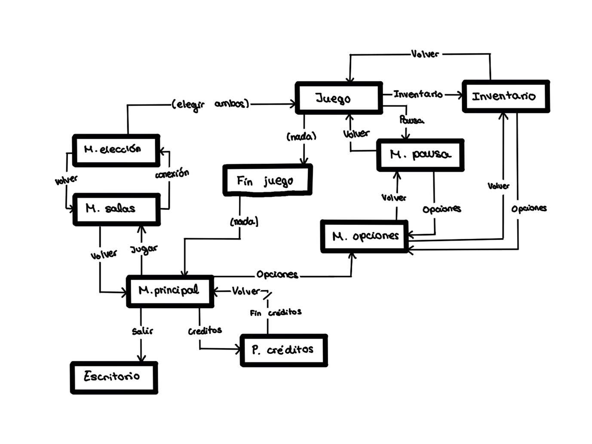

# Mystery-Mice
Descripción temática del juego:
  Mystery Mice es un juego de investigación que se centra en la cooperación entre dos jugadores, cada uno con un ratón detective, en el que deberán resolver el misterio paranormal que se cierne sobre el pueblo de VillaCheddar. Para ello, tendrán que compenetrarse y utilizar la habilidad única y especial de su ratón correctamente. Utilizando a ambos de la manera apropiada, desenmascararán la verdad oculta que hay tras tales misteriosas entidades.

Integrantes: Laura Facenda Estrella - l.facenda.2022@alumnos.urjc.es - lauura04

David del Castillo Enríquez - d.delcastillo.2022@alumnos.urjc.es - DavidDelCastillo

Daniel Duque Rodríguez - d.duque.2021@alumnos.urjc.es - Daniii18

María de Andrés Jarandilla - m.deandres.2021@alumnos.urjc.es - MariaDeAndres

 Forma

Descripción generada automáticamente con confianza media 
 

GAME DESIGN DOCUMENT

 

Mystery Mice 

INTRODUCCIÓN 

Título 

El título del juego es Mystery Mice. 

Concepto principal 

Mystery Mice es un juego de investigación que se centra en la cooperación entre dos jugadores, cada uno con un ratón detective, en el que deberán resolver el misterio paranormal que se cierne sobre el pueblo de VillaCheddar. Para ello, tendrán que compenetrarse y utilizar la habilidad única y especial de su ratón correctamente. Mientras que uno de ellos utiliza su visión nocturna para detectar huellas o rastros que van dejando los fantasmas, el otro usa su superolfato para identificar el olor del plasma y determinar cuánto tiempo hace que el fantasma pasó por allí. Tras investigar, descubrirán que una oscura realidad se esconde tras los sucesos paranormales. Utilizando a ambos de manera apropiada, desenmascararán la verdad oculta que hay tras tales misteriosas entidades. 

Características generales 

Juego cooperativo para 2 jugadores: Cada jugador controlará a un ratón con habilidades únicas. Dependiendo del ratón que escoja cada jugador, podrá hacer determinadas cosas y otras que no, las cuales solo su compañero será capaz de llevar a cabo. La clave está en la cooperación, ambos ratones deben trabajar juntos para descubrir pistas que, por separado, no podrían obtener.  

Historia intrigante: Los jugadores están inmersos en un misterio paranormal que ocurre en VillaCheddar, donde los fantasmas están causando caos en el pueblo. Al avanzar en la trama, descubrirán que estos sucesos paranormales esconden una verdad más oscura, y deben desenmascarar qué está ocurriendo realmente. 

Puzles: Para avanzar en el juego, los jugadores deberán resolver puzles cooperativos que utilizan las habilidades únicas de cada ratón. Algunos puzles requerirán pensamiento estratégico y mucha coordinación entre los dos jugadores, donde los datos sensoriales (vista/olfato) se combinarán para solucionar el misterio. 

Progresión de niveles: El juego está dividido en diferentes niveles, representados por casas misteriosas que los jugadores deben investigar. Cada nivel tiene una dificultad creciente, en la que los fantasmas se vuelven más difíciles de rastrear e identificar, y los puzles se tornan más complejos. Con cada casa investigada, la historia avanza, revelando más detalles sobre la realidad oculta detrás de los sucesos paranormales. 

Género 

Misterio/Suspense Paranormal: Combina investigación, resolución de acertijos y exploración con elementos de suspense, mientras el jugador intenta descubrir el tipo de fantasma que habita en cada casa. 

Plataforma 

La plataforma elegida para el juego es PC. 

Público Objetivo 

Nuestro videojuego busca atraer a aquel público interesado en las experiencias de misterio e investigación con toques sobrenaturales, similares a series como “Scooby-Doo” o juegos como “Luigi's Mansion”.  Las personas que decidan jugar a nuestro juego no necesitan tener mucha experiencia con los videojuegos lo que nos amplia el público objetivo buscado. 

Jugabilidad 

Como se ha mencionado anteriormente cada ratón tiene una habilidad única permitiendo al primer ratón ver huellas o rastros con su magnífica visión nocturna, mientras que el compañero tendrá la posibilidad de olfatear el olor que dejan los fantasmas usando su increíble olfato.  La cooperación dentro del juego será muy importante a la hora de recopilar pruebas y resolver distintos acertijos. 

Estilo Visual 

El juego estará formado por Sprites 2D, tanto para el escenario como para los distintos personajes, inspirados en el estilo artístico representado en la saga “Profesor Layton” y conformado por una paleta de colores otoñales. Los personajes contarán con unas animaciones fluidas capaces de transmitir el carácter y personalidad de cada uno de ellos.  

El profesor Layton y la villa misteriosa (2007)
 

DISEÑO DEL JUEGO 

 

Guion 

VillaCheddar siempre ha sido conocida por la presencia de eventos paranormales que allí suceden. Desde Mystery Mice, la empresa de la familia de ratones Arat, son los encargados del pueblo de acabar con estos hechos, que, tras el eclipse de la Luna de Roquefort, no han hecho más que aumentar, atormentando así a los pocos habitantes que allí quedan. Por ello, por encargo de la alcaldesa del pueblo y en colaboración con los vecinos irán casa por casa para tratar de identificar los entes que allí se encuentran para su posterior eliminación y poder así vivir en calma de una vez por todas. 

 

Los miembros de la familia Arat siempre han sido conocidos por tener grandes habilidades cuando en lo paranormal se trata, y no solo porque vengan de una larga descendencia de cazarratafantasmas mundialmente conocida, también por sus altas capacidades y sentidos altamente desarrollados, aunque en la última generación Arat, dicho desarrollo se vio interrumpido por la pronta muerte de sus padres, haciendo así que los hermanos Sighttail y Scentpaw dejaran de formarse en la escuela y se hicieran cargo del negocio familiar.  

 

Debido a dicha interrupción, no pudieron alcanzar su máximo auge, haciendo así que Sighttail fuera el único en la familia capaz de poder ver en la oscuridad y que Scentpaw sea quien pueda detectar mediante su olfato el rastro que van dejando los fantasmas, así como averiguar cuánto tiempo hace que los fantasmas se alejaron de allí.  

 

Con cada fantasma que descubran les irá dando pistas a un misterio mayor, el origen de dichos entes, ya que VillaCheddar oculta un gran secreto y es que los fantasmas no son simples ratas en pena que vagan sin llegar al inframundo, sino que son antiguos habitantes del pueblo, quienes murieron en extrañas condiciones. En el proceso de resolver dicho misterio se encontrarán también con los espíritus de sus padres, quienes les contarán la verdad acerca del pueblo y el motivo oculto tras la muerte de ambos.  

 

Al final del juego descubrirán que la alcaldesa, quien creían que estaba interesada en acabar con los fantasmas, realmente quería acabar con ellos mandándolos contra estos ya que es la verdadera causante de todo, se trata de un espíritu ancestral completamente enfadado con el pueblo por haber olvidado las viejas costumbres de culto a su religión.  

 

Mecánicas 

El juego se va a caracterizar principalmente por el uso coordinado de las habilidades de los personajes, así como una combinación con los ítems existentes en el juego. 

 

Visión + lupa: gracias a la lupa, Sighttail puede analizar huellas, rastros o marcas de fantasmas, permitiendo así distinguir de qué tipo de fantasma se trata en función del tipo de huella. 

 

Visión nocturna: es capaz de ver en sitios donde la luz se encuentra ausente. 

 

Olfato: gracias al olfato, Scentpaw será capaz de seguir rastros que Sighttail no es capaz de percibir ya que son solo aromas presentes en el aire. 

 

Los ratones podrán moverse por los escenarios libremente por las casas mediante el teclado y habrá una tecla para activar las habilidades, ya que no podrán tenerlas activadas de forma continua y solo pueden estar ambas activadas a la vez durante 5 segundos.  

 

Puzzles de ingenio en los que tienen que combinar ambas habilidades. Ejemplo: mediante la habilidad de Sighttail en una habitación nocturna tiene que usar su habilidad para poder guiar a Scentpaw a través de un laberinto en el que para ver a dónde tiene que ir siguiendo un rastro olfativo. 

 

 

Estados 

Menú principal: la pirmera pantalla que aparece al abrir el juego. Desde aquí se puede entrar o salir del juego y acceder a los ajustes o a la pantalla de créditos. 

Menú de salas: en este menú se podrá acceder a la conexión de los dispositivos que jugarán juntos. 

Menú de selección: inmediatamente posterior al menú de salas, desde aqui los jugadores seleccionarán con qué personaje quieren jugar y empezarán la partida. 

Juego: todo el contenido jugable de la historia. 

Inventario: apartado del juego en el que se puede acceder a pistas, objetos, diálogos que ya han ocurrido y herramientas interesantes. 

Menú de pausa: accesible en todo momento desde el juego y desde el que se puede acceder a los ajustes. 

Fin del juego: una pantalla de game over que te lleva de vuelta al menu pricipal cuando acabas el juego. 

 

Se incluye a continuación una versión ilustrada de los estados, con las condiciones para pasar de unos a otros: 

 

Interfaces 

La idea es que las interfaces tengan la temática visual de investigación, ya sea con una fuente que se asemeje a la de las máquinas de escribir o por medio de iconos y paleta de colores en sintonía con el resto del juego. 

Un estilo minimalista, con flechas y poco texto sería lo más adecuado para este estilo visual, además de hacer la navegación más intuitiva. 

Como no hay forma de moverse entre niveles, ya que la historia es lineal, no habrá un mapa. 

Se describen los botones a partir de los distintos estados: 

Menú principal: botones de jugar, opciones, salir, controles y créditos. 

Menú de salas: botones para crear sala o unirte a sala. 

Menú de opciones: + y – para volumen, tamaño de la pantalla (completa: si/no). 

Menú de pausa: volver al menú (principal), salir de sala (menu de salas), salir, continuar, opciones. 

Dentro del juego: botón de pausa arriba a la derecha, inmediatamente a la izquierda un botón de inventario/maletín/diario, algo para llevar cuenta de las pistas, objetos, información de los fantasmas... 

Todas las pantallas (menos principal): botón “atrás” arriba a la izquierda. 

DESARROLLO DEL JUEGO 

Niveles 

La idea original es hacer tres niveles, y en cada uno de ellos se desarrolla una parte de la historia. 

Nivel 1. El Laberinto del Cazador Oculto. 

El fantasma de un cazador se encuentra en una vieja cripta cercana a la casa de la familia Arat y los hermanos deciden empezar a cazar fantasmas por ahí. 

Este cazador murió tras la traición de otro habitante y por ello se encuentra enfadado en busca de su venganza. 

En este nivel, los jugadores llegan a la puerta de la cripta, una zona con muy poca iluminación, y se encuentran con la puerta cerrada. Mediante la vista de Sighttail y el olfato de Scentpaw encontrarán un agujero en la cripta para poder entrar en el edificio. 

Dentro de la cripta se encuentran con que están en un laberinto lleno de trampas, que en función de qué trampa sea un ratón u otro podrá salvar al otro. 

Trampa de Flechas Fantasmales: ciertos muros cuentan con ranuras ocultas desde donde se disparan flechas. Sighttail es capaz de ver el brillo que desprenden las flechas mientras que Scentpaw es capaz de oler el hedor fantasmal de las flechas, confirmando así que se encuentran en una zona de flechas. Mediante la vista de Sighttail tienen que ser capaces de atravesar esas fases sin ser golpeados por las flechas. 

 

Neblina Tóxica: algunas partes del laberinto están llenas de una neblina fantasmal que va debilitando a los personajes si se quedan demasiado tiempo en ella. Scentpaw es el único que puede percibir la niebla y Sighttail mientras tiene que encontrar una ruta alternativa para huir de esa zona cuanto antes. 

 

Paredes móviles: algunas paredes del laberinto se mueven para confundir a los jugadores. Scentpaw es capaz de oler los restos de energías espectrales que quedan tras estas paredes. Dichas paredes son las que llevan a los jugadores al centro del laberinto, que es donde se encuentra el cazador. 

 

Cuando lleguen al cazador les contará su historia, descubriendo así que fue traicionado por cierto habitante con alto nivel de influencia. Junto al cazador descubren una carta escrita por el padre de estos, en la que se menciona que estaban investigando a la alcaldesa. 

 

Nivel 2. La Quesería Encantada. 

Varios trabajadores murieron tras un derrumbe misterioso. La quesería se encuentra llena de ruidos paranormales. 

Los fantasmas allí presentes eran antiguos trabajadores que murieron tras un accidente que nunca fue investigado. Explorando descubrieron que las condiciones inseguras de la fábrica fueron culpa de una negligencia intencionada, a sabiendas de la alcaldesa, quien estaba implicada en el accidente. 

La quesería está llena de viejas máquinas que deben ser sincronizadas para liberar a los fantasmas que allí se encuentran. Para que se activen las máquinas tienen que activar los mecanismos al mismo tiempo. Para ello, Sighttail mediante su lupa tiene que identificar qué máquinas son las que están activas y el orden en el que deben ser reparadas mientras que Scentpaw junto con su olfato tiene que seguir rastros de aceite fantasmal, localizando así las áreas en las que se encuentran los fantasmas.  

Ambos jugadores tienen que activar los mecanismos al mismo tiempo para que las máquinas funcionen. En el caso de que fallen, las máquinas se desincronizan y generan fallos, provocando más fantasmas. En el caso de resolverlo, las almas de los trabajadores se liberan. En el proceso de resolverlo encuentran un cuaderno perteneciente a la madre de los hermanos, donde encuentran notas sobre sobre los fantasmas de la quesería, así como una extraña energía que encontraron en el pueblo.  

Una vez liberan a los trabajadores, estos les explican que la alcaldesa estaba practicando antiguos rituales en secreto y antes de que los padres de ellos pudieran actuar para impedirla, desaparecieron sin dejar rastro. 

 

Nivel 3. El Orfanato de las Sombras. 

Antes de la Luna de Roquefort desaparecieron los niños que quedaban en el viejo orfanato del pueblo, donde se rumorea que se esconden ciertos secretos oscuros acerca de rituales antiguos. 

Los niños que allí vivían fueron sacrificados en un antiguo ritual para calmar un espíritu ancestral, quien resulta ser la alcaldesa. 

El puzzle comienza en un pasillo largo y oscuro con sombras que se mueven bloqueando el paso. Tiene que ser Sighttail quien guie a Scentpaw a través del pasillo mientras interactúan con interruptores ocultos que es Scentpaw quien puede averiguar cuáles son aquellos los que tienen que pulsar mediante el olfato mientras siguen el rastro de los niños fantasmales. Aquellas zonas en las que más rastro hay son aquellas en las que más conexión tienen con el ritual. 

Una vez llegan a la sala de rituales encuentran a los espíritus de sus padres atrapados en una prisión fantasmal y les revelan que fue la alcaldesa la responsable de la muerte de ambos, así como del resto de hechos del pueblo. 

 

Personajes 

Los protagonistas, Sighttail y Scentpaw, controlados por el jugador: Sighttail lleva gafas y tiene las orejas grandes. Además, tiene el pelaje algo largo y la cola negra. Por otro lado, Scentpaw tiene un gorro de investigador y las orejas más pequeñas que su hermano. Su pelaje es corto y su cola, rosada. 

 

Alcaldesa: Es una mujer grande e imponente con un toque elegante que le vienen perfecto para su cargo. Viste recatada y siempre va como un pincel. En su versión espiritual, se vuelve incluso más grande, dejando su ropa como trapos desgreñados y su pelo recogido pasa a parecer un nido. 

 

Los padres de Sighttail y Scentpaw: ambos aparecen juntos. Se les puede ver vistiendo ropa de investigadores, aunque se nota más antigua a la que se ve durante el juego ya que han pasado muchos años. Ambos ratones son algo rechonchos, lo que da apariencia bondadosa a los personajes y sus expresiones son de orgullo hacia sus hijos. 

 

Trabajadores de la quesería: todos se presentan con monos de trabajo y gorros para mantener un espacio salubre en la fábrica. A la hora de presentarse, todos siguen con algo de temor en sus caras. 

 

Huérfanos sacrificados: Sus fantasmas se verán pequeños y frágiles, con las ropas desgastadas y algunos descalzos. Todos bastante delgados debido a la escasez de comida y a la multitud de niños. 

 

El cazador de la cripta: Este ratón es robusto y atlético. Es alto, pero lo suficientemente sigiloso como para pasar desapercibido. Viste ropa de caza y lleva una escopeta. 

 
Ítems 

Los ítems presentes en el juego son claves para el desarrollo clave del juego. 

Lupa: sirve para analizar las huellas y demás pistas encontradas. 

Cuaderno: contiene todos los datos de la investigación. 

Trampa para fantasmas: en su versión pequeña, mediana y grande dependiendo de lo huidizos que sean los fantasmas. 

Dispositivo de retención de fantasmas: junto con las trampas, ayudan a detener a los fantasmas que se niegan a colaborar en la investigación, manteniéndolos inmóviles para los interrogatorios. 

Carta familiar: la carta que los padres de Sighttail y Scentpaw les dejan antes de morir. Contiene información relativa a lo que les pasó. 

Diario: cuaderno que los hermanos encuentran durante el nivel 2 y que contiene notas de su madre acerca de lo que ocurrió en la quesería. 